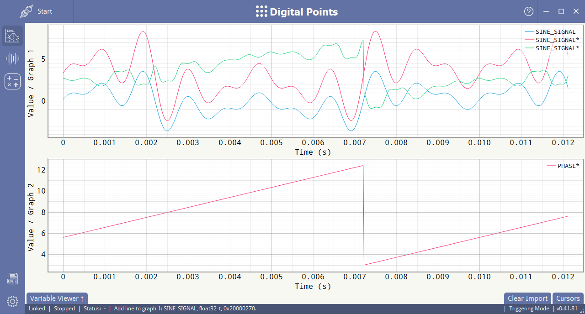
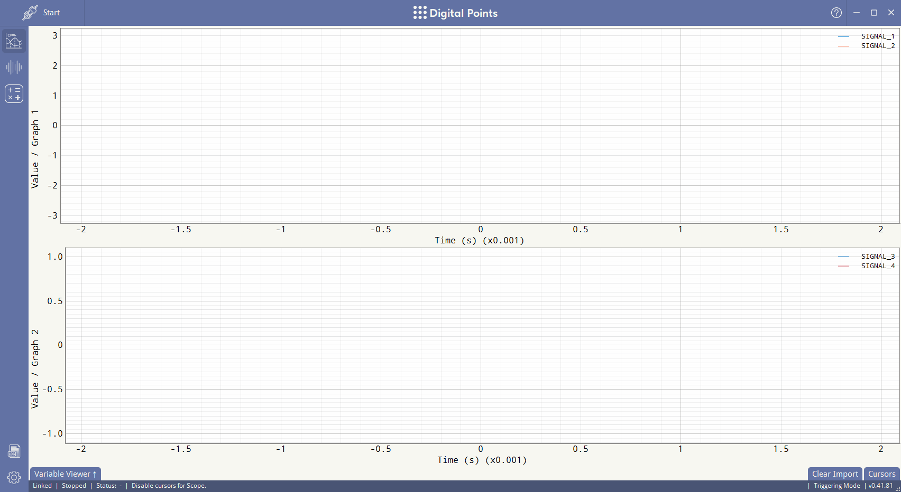
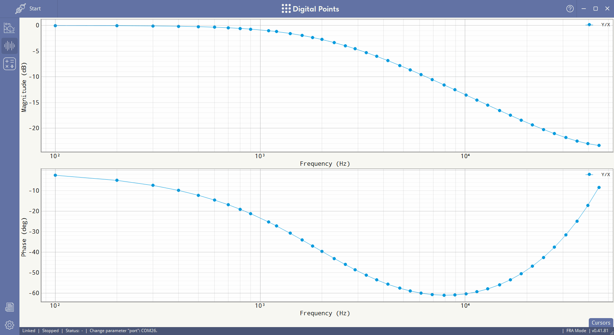

<h1 align="center"><br>Digital Points</h1>

<h3 align="center">[<a
href="#about">About</a>] [<a
href="#features">Features</a>] [<a
href="https://github.com/jankinjack/digital-points/wiki">Wiki</a>] [<a
href="#build-from-source">Build from source</a>]</h3>



## About

Digital Points is an open-source real-time debugging tool for embedded systems. It functions as a software oscilloscope and enables developers to read and visualize microcontroller variables via standard communication interfaces (serial, CAN), perform FFT/DSP operations, measure frequency responses (Bode plots), and design digital PID controllers.

Supported MCU architectures:
- ARM Cortex-M4/M7 (gcc, clang)
- TI C2000 (cl2000)
- RISC-V RV32I (gcc)

### Features

- **Real-Time Mode**: Reads the selected variables at the maximum available rate.


- **Triggered Mode**: Captures variables within a time window at a specified sampling frequency.



- **Frequency Response Analysis (FRA) Mode**: Measures frequency responses of a real-time control system using single-tone excitation with stepped frequency sweep or multi-tone excitation.


- **Digital PID Controller Design**: Calculates digital PID controller coefficients based on frequency responses.



## Quickstart

See [Wiki](https://github.com/jankinjack/digital-points/wiki#installation).

## Build from source

Clone the repository from GitHub:

```bash
git clone https://github.com/jankinjack/digital-points.git
cd digital-points
```

or from SourceCraft:

```bash
git clone https://git@git.sourcecraft.dev/jankinjack/digital-points.git
cd digital-points
```

### Build Client

1. Install Python 3.11 or later.

2. Install dependencies:

```bash
python -m pip install -r requirements.txt
```

1. Install [MSVC](https://visualstudio.microsoft.com/ru/vs/features/cplusplus/).

2. Run the build script:

```bash
python build_client.py
```

### Build Server

1. Install compilers and add them to PATH:

    - [GCC](https://gcc.gnu.org/) / [MSYS2 GCC](https://packages.msys2.org/packages/gcc)
    - [Clang](https://clang.llvm.org/) / [MSYS2 LLVM](https://packages.msys2.org/packages/llvm)
    - [C2000-CGT](https://www.ti.com/tool/C2000-CGT)

2. Install [Meson Build](https://mesonbuild.com/) and add it to PATH.

3. Run the build script:

```bash
python build_server.py
```
