**1 August 2026**

This is the story of how an internal software debugging tool grew into a project that never quite became a commercial product, and why we ultimately open-sourced it in hopes of giving it a second life. Along the way, I'll also walk through what this tool can do.

# How It All Started

## From Idea to Prototype

It was 2020. I was working as an embedded software developer at a company that designed and manufactured high-power industrial electric drives (hundreds of kW up to several MW). At the same time, I was doing my master's degree and working as a junior research fellow at the university.

At the time, I was programming the control system for a reversible thyristor converter for a DC electric drive rated up to 1 MW, running on an STM32F746. I debugged slow processes (rotational speed, power consumption) over Modbus RTU/TCP, and fast ones (currents, voltages, commutation angles) via DAC or PWM output signals followed by filtering. Debugging under these conditions is a sport in its own right — especially when a protection trip fires or the thyristor bridges switch over, and you need to figure out what happened in the milliseconds before and after, capturing signals at a rate at least matching the control system's own sampling rate (20-100 kHz). On top of that, you somehow need to evaluate the speed of response, stability margins, and behavior of software [control loops](https://en.wikipedia.org/wiki/Feedback), [digital filters](https://en.wikipedia.org/wiki/Digital_filter), [observers](https://en.wikipedia.org/wiki/State_observer), and other dynamic subsystems. Without enough insight into what's happening inside the system, all you're left with is guesswork and indirect estimates.

That's when the idea came up: write a program that could read the MCU's internal variables the way an oscilloscope reads signals. Data exchange only over standard communication interfaces (RS-485, CAN, Ethernet...), because debugging via JTAG emulators at 6 kV or under kiloampere currents is not for the faint of heart. The idea was inspired by [STM Studio](https://www.st.com/en/development-tools/stm-studio-stm32.html), which by now is deprecated, and has since been effectively superseded by [STM32CubeMonitor](https://www.st.com/en/development-tools/stm32cubemonitor.html).

I wrote the first version that same year. Working title: **Plotter**. It inherited its key features from STM Studio:
- An architectural split between a PC GUI client (hereafter "client") and a library for the microcontroller firmware (hereafter "server"). The client was written in C++/Qt, the server in plain C with no ties to MCU peripherals — logic only. On the client side, serial COM port and Ethernet were supported.
- Loading a list of the MCU's global variables with their names, types, and memory addresses. Back then this simply meant parsing a txt file generated by ARM Compiler 6 (clang).
- The server reading variable values from memory by address and sending them to the client over the interface.

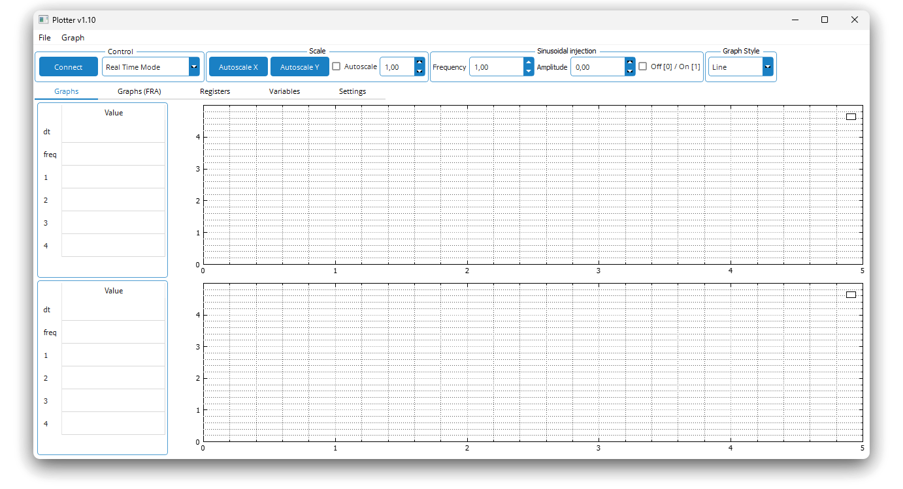

This meant you weren't locked into a predefined set of variables — you could pick which ones to read on the fly, without reflashing, saving a lot of time.

Plotter had two main modes.

**Real-time mode**: the client periodically requested the selected variables, measured the time between requests, and plotted the values on a graph. The request rate was limited only by the interface's bitrate, the number of variables, and the MCU's load.

**Trigger mode**: the client sent trigger conditions (variable, threshold, edge type) along with the addresses of the variables to read. The server would then cyclically write variable values into a buffer until the trigger fired. Once triggered, the buffer was sent to the client at whatever speed the interface allowed and plotted on the graph. The buffering window's duration equals `n` / `f_s`, where `n` is the buffer size and `f_s` is the sampling rate (the rate at which values are added to the buffer).

The tool caught on: we used it for commissioning the thyristor drive mentioned above, as well as for debugging a reactive power compensator and a monitoring system for a passive harmonic filter. By 2022, when I left the company, Plotter had gained the beginnings of another feature — measuring the <abbr title="Frequency Response">FR</abbr> of individual dynamic links: for example, the "voltage → rotational speed" FR of the motor, or the "reference → measured current" FR of the closed current control loop. This made it possible to judge the behavior and tuning quality of control loops from objective data instead of eyeballing it.

## From Prototype to Startup

After leaving the company, I focused on academic research and finishing my PhD thesis. After defending the thesis in 2024, the inevitable financial question came up: what to live on next. By that point I was already freelancing — designing and programming control systems for power converters on a contract basis, and running professional-development courses together with my academic advisor, who is now the startup's second co-founder.

That's when my advisor and I decided to try something new, and the idea came up to commercialize Plotter (there'd been no NDA at my previous job).

For this, we rewrote the client in Python 3, reworked the server, and registered a company. New name: **Digital Points**. What followed was the typical startup quest, about a year and a half long: business accelerators, business incubators, venture fairs, conferences, exhibitions. We'd periodically recalculate the sacred <abbr title="Total Addressable Market / Serviceable Available Market / Serviceable Obtainable Market">TAM/SAM/SOM</abbr>, getting different numbers every time (we're apparently mediocre financiers).

Despite all the effort, things were tough going. Investors and business experts would say the project was extremely interesting and the startup was about to take off into the stratosphere, while potential users would say they could build something like this themselves with a couple of free hours, a cup of coffee, and several prompts to an LLM (maybe they're right). Along with that came the realization that what we actually enjoy is solving technical problems — not chasing leads, packaging a product, pivoting, and pitching.

On top of that, our "zero-activity" company started costing us around $1,300/year in insurance contributions even with zero payroll and zero revenue — and with accounting fees added in, that climbs to as much as $2,000/year for essentially nothing. So after several months of unsuccessful negotiations over an outright sale or a relaunch of the project, we decided to set it free and release it as open source.

What follows is a description of Digital Points' main features.

# Inside Digital Points

The Digital Points client (hereafter DP) is written in Python 3. Under the hood:
- `PySide6` for the GUI.
- `pyqtgraph` for plotting graphs.
- `pyserial` and `python-can` for the serial interface and CAN, respectively. The server has no ties to MCU peripherals, so support for new interfaces only needs to be implemented on the client side.
- `numpy` and `sympy` for math.
- `pyelftools` for parsing debug information from ELF files.

The server is written in plain C with no dependencies.

The core stayed the same: real-time mode, trigger mode, variable list loading, and FR measurement. New additions: <abbr title="Fast Fourier Transform">FFT</abbr>, <abbr title="Digital Signal Processing">DSP</abbr> tools, automatic real-time data dumps, and <abbr title="Proportional-Integral-Derivative">PID</abbr> controller calculation. The list of supported architectures grew too: ARM Cortex-M4/M7, TI C2000, RISC-V (MIK32).

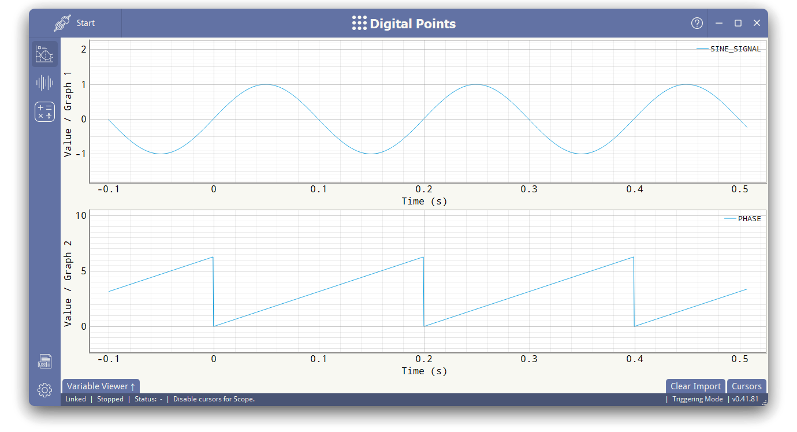

## Loading the Variable List

In Plotter, everything was simple: clang generated a txt file listing the global variables along with their addresses and types. That was enough for internal use, but the approach was far from universal. We had to dig into parsing DWARF-format debug information from ELF files.

Unlike a txt file, which is specific to a particular compiler, ELF files are generated by compilers (gcc, clang, TI C2000 C/C++ Compiler) in a standard format. These are the same files debuggers use. At the time, we couldn't find a ready-made Python solution for locating variables in ELF files — or we just didn't search hard enough — so we ended up writing one ourselves. Maybe not the most efficient use of our time, but it is what it is.

We extract the debug information — a tree of <abbr title="Debugging information entry.">DIE</abbr> nodes — from the ELF file's `.debug_info` section using `pyelftools`. We also pull the list of global variable names from the `.symtab` section. Then we walk the whole tree looking for the variables on that list. You can read more about the DWARF format [in this article](https://calabro.io/dwarf) or on the [format's official website](https://dwarfstd.org/).

The end result is a complete picture of all the MCU's global variables — accounting for debug info lost to compiler optimization (register allocation) — including names, memory addresses, data types, and sizes in bytes. Down the road, static variables with fixed addresses could be added to this list as well.

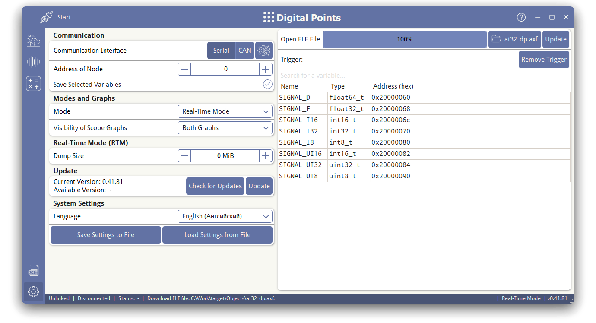

## Memory Allocation on the MCU Side

In Plotter, the number of variables that could be read simultaneously was hardcoded into the server code. Again, that was fine for internal use. In DP, though, we wanted more flexibility while still being able to explicitly cap the amount of MCU memory used.

When the server initializes, the user declares an array of a fixed size, and DP allocates its objects inside it without ever exceeding that bound. It works similarly to `heap_1.c` in FreeRTOS. Receive and transmit buffers, trigger-mode buffers — everything lives inside that allocated array, making the most of the available memory. The only exception is the server's internal global data structures.

## Real-Time Mode + Auto-Dumps

Real-time mode is unchanged, aside from one new feature: automatic dumping during long runs.

Thermal tests, load tests, and failure tests for electrical equipment can run for hours or even days. At 100 Mbit/s Ethernet speeds, one hour of continuous measurement will accumulate over 40 GB of data — far more than the RAM in a typical work laptop.

Periodically dumping data to disk saves you from running out of memory. In DP you can set a dump threshold in MB. As soon as the data volume exceeds that threshold, it's flushed to disk, cleared from RAM, and the corresponding dump file's name is marked on the graphs.

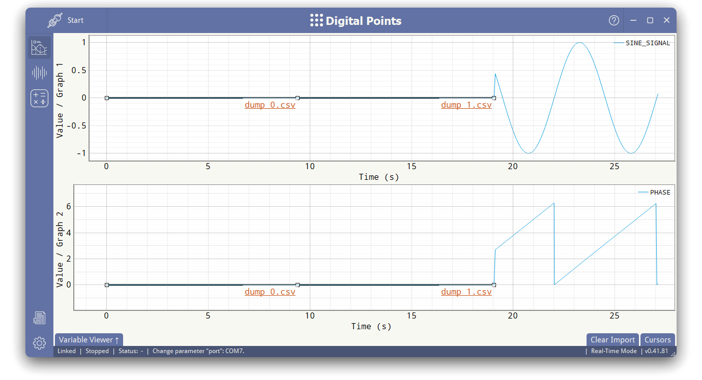

## Trigger Mode

The core of this mode is also unchanged, but we added several useful settings, many of them borrowed from oscilloscopes:
- Number of points before and after the trigger.
- Trigger delay — the time after start-up during which the trigger ignores events.
- Trigger skipping — for example, if you only want to catch every n-th trigger.
- One-shot mode (single trigger).
- Free-run mode — starting without a trigger, as if it fired immediately when the measurement started.

## FFT and DSP Tools

You can run an FFT on signals captured in either trigger or real-time mode. All you need to do is specify the time interval to transform. You can assess a signal's spectral content right there, without exporting to any third-party tools.

Signals can also be transformed using formulas: arithmetic, math functions, filters, integral metrics. Formulas can be applied to a single variable or to several at once.

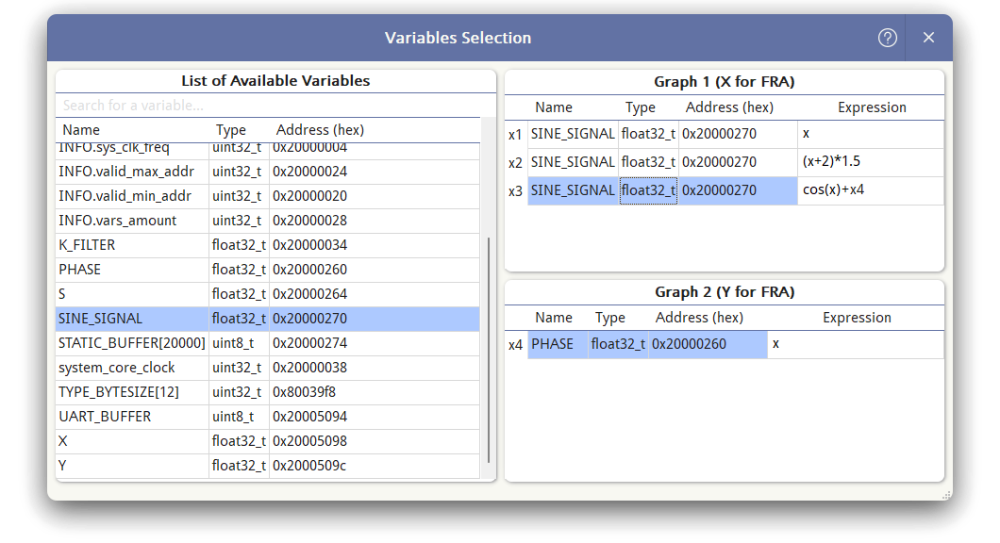


## Frequency Response Measurement

The most interesting part of Digital Points is frequency response measurement. This tool lets you measure the FR of practically any transfer function in the system programmatically: the plant, the controller, feedback paths, filters, sensitivity functions, and more.

In general, the measurement principle works like this:
- The client generates an array of `n` disturbance values (the injection signal) and sends it to the server.
- On every tick (at sampling rate $f_s / d$), the server outputs the next value from the injection array, which the user is expected to add to the relevant variable inside the software control loop.
- Simultaneously with the injection, the server captures time-domain "snapshots" of two variables — call them $x(t)$ and $y(t)$ (the system's response) — as arrays of `n` values each and sends them to the client.
- The client runs an FFT on the snapshots, extracts the complex amplitudes $X(j\omega)$, $Y(j\omega)$ for one or several harmonics numbered `h` ($\omega = h\omega_{min}$), and computes their magnitudes $|X(j\omega)|$, $|Y(j\omega)|$ and phases $\arg X(j\omega)$, $\arg Y(j\omega)$.
- The injection frequency and amplitude are then changed (for single-harmonic measurement), and the cycle repeats.

Time for a single measurement, excluding overhead: `(n*d)/f_s`.

This produces arrays of magnitudes and phases, from which the <abbr title="logarithmic magnitude and phase responses">Bode magnitude and phase plots</abbr> are built. The magnitude ratio $20 \log_{10} |Y(j\omega)| / |X(j\omega)|$ gives the Bode magnitude plot; the phase difference $\arg Y(j\omega) - \arg X(j\omega)$ gives the Bode phase plot.

This is exactly how vector network analyzers like the [AP Instruments Model 310](http://www.apinstruments.com/products.html) or the [OMICRON Lab Bode 100](https://www.omicron-lab.com/products/vector-network-analysis/bode-100) work — DP just does it in software.

DP implements two types of FR measurement, depending on the injection signal type: *single-harmonic* and *polyharmonic*. For both, an array of `n_freq` harmonic frequencies of interest is built, spanning a user-defined range from `f_min` to `f_max`.

### Single-Harmonic

The frequency array and measurement window can be built using either of two methods, though the measurement principle itself is the same for both.

**Method `h = 1`**

Injection and measurement are performed over just a single period of whichever frequency is currently being measured. The buffer is underutilized, but the measurement time is minimal.

<spoiler title="Python script for the calculation, with results">

```python
import numpy as np

f_s = ...
f_min = ...
f_max = ...
n_freq = ...
n_max = ...

# Initial calculation of point counts and frequencies with a logarithmic distribution.
f = np.geomspace(f_min, f_max, num=n_freq)
n = np.maximum(np.floor(f_s / f + 0.5), 1).astype(np.uint64)

# Calculate decimation factors.
d = np.maximum(np.ceil(n / n_max), 1).astype(np.uint64)

# Recalculate point counts accounting for decimation.
n = np.maximum(np.floor(n / d.astype(np.float64) + 0.5), 1).astype(np.uint64)

# Recalculate frequencies.
f = f_s / (n * d)

# Calculate harmonic numbers.
# For this method, all harmonics are the fundamental (h = 1).
h = np.ones(n_freq).astype(np.uint64)
```

Example calculation result for `f_s = 100e3`, `f_min = 10`, `f_max = 5000`, `n_freq = 10`, `n_max = 1000`:

```python
f = [10.0000, 19.9362, 39.7772, 79.3651, 158.2278, 315.4574, 628.9308, 1250.0000, 2500.0000, 5000.0000]
n = [1000, 836, 838, 630, 632, 317, 159, 80, 40, 20]
d = [10, 6, 3, 2, 1, 1, 1, 1, 1, 1]
h = [1, 1, 1, 1, 1, 1, 1, 1, 1, 1]
```

</spoiler>

**Method `h = var`**

Injection and measurement are performed over the maximum possible number of periods. The buffer is used to its fullest, but the measurement time goes up.

<spoiler title="Python script for the calculation, with results">

```python
import numpy as np

f_s = ...
f_min = ...
f_max = ...
n_freq = ...
n_max = ...

# Initial calculation of point counts and frequencies with a logarithmic distribution.
f = np.geomspace(f_min, f_max, num=n_freq)
n_base = np.maximum(np.floor(f_s / f + 0.5), 1).astype(np.uint64)

# Mask for point counts exceeding the maximum.
mask = n_base > n_max
inv_mask = ~mask

# Initialize decimation factors and harmonic numbers.
d = np.ones(n_freq, dtype=np.uint64)
h = np.ones(n_freq, dtype=np.uint64)

n = n_base.copy()

# If there are more points than allowed, calculate decimation.
d[mask] = np.ceil(n_base[mask] / n_max).astype(np.uint64)
n[mask] = np.ceil(n_base[mask] / d[mask]).astype(np.uint64)
f[mask] = f_s / (n[mask] * d[mask])

# If there are fewer points than allowed, calculate harmonic numbers.
h[inv_mask] = np.maximum(np.floor(n_max / n_base[inv_mask]), 1).astype(np.uint64)
n[inv_mask] = np.floor(h[inv_mask] * n_base[inv_mask] + 0.5).astype(np.uint64)
f[inv_mask] = (h[inv_mask] * f_s) / n[inv_mask]

# Recalculate point counts.
n = np.maximum(np.floor(n + 0.5), 1).astype(np.uint64)
```

Example calculation result for `f_s = 100e3`, `f_min = 10`, `f_max = 5000`, `n_freq = 10`, `n_max = 1000`:

```python
f = [10.0000, 19.9362, 39.7772, 79.3651, 158.2278, 315.4574, 628.9308, 1250.0000, 2500.0000, 5000.0000]
n = [1000, 836, 838, 630, 632, 951, 954, 960, 1000, 1000]
d = [10, 6, 3, 2, 1, 1, 1, 1, 1, 1]
h = [1, 1, 1, 1, 1, 3, 6, 12, 25, 50]
```

</spoiler>

With both methods, the resulting frequencies end up as close as possible to the requested ones. The difference in decimation factors and point counts shows up mainly at higher frequencies, and probably affects measurement accuracy, though we haven't looked into that.

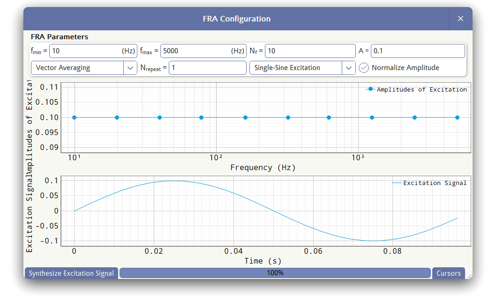

### Polyharmonic

The spectrum of a polyharmonic injection signal must contain only harmonics that are multiples of the fundamental at frequency `f_min`, so there's only one way to build the frequency array.

<spoiler title="Python script for the calculation, with results">

```python
import numpy as np

f_s = ...
f_min = ...
f_max = ...
n_freq = ...
n_max = ...

# Calculate the decimation factor.
d = np.maximum(np.ceil(f_s / f_min / n_max), 1).astype(np.uint64)

# Recalculate the number of points.
n_max = np.round(f_s / f_min / d).astype(np.uint64)

# Calculate the maximum harmonic number.
h_max = int(min(n_max / 2, f_max / f_min / 2))

# Build the harmonic array with a logarithmic distribution.
h = np.unique(np.rint(np.geomspace(1, h_max, num=n_freq)).astype(np.uint64))

# Calculate the decimation factor.
d = np.full(len(h), np.ceil(f_s / f_min / n_max), dtype=np.uint64)

# Calculate point counts and frequencies.
n = np.full(len(h), n_max, dtype=np.uint64)
f = f_s / (d * n) * h
```

Example calculation result for `f_s = 100e3`, `f_min = 10`, `f_max = 5000`, `n_freq = 10`, `n_max = 1000`:

```python
f = [10.0000, 20.0000, 40.0000, 80.0000, 160.0000, 320.0000, 630.0000, 1260.0000, 2510.0000, 5000.0000]
n = [1000, 1000, 1000, 1000, 1000, 1000, 1000, 1000, 1000, 1000]
d = [10, 10, 10, 10, 10, 10, 10, 10, 10, 10]
h = [1, 2, 4, 8, 16, 32, 63, 126, 251, 500]
```

</spoiler>

The injection signal is synthesized as the sum of all target harmonics with equal amplitudes `A` and different phases `ph[h]`. It's then sent to the server just like before, injected, the response is measured, an FFT is run, and the harmonic magnitudes and phases are extracted. A single cycle produces the full magnitude and phase arrays, and the Bode magnitude and phase plots are built from them.

As a rule, the injection is added inside the software control loop and physically drives the system's actuators, which means its amplitude can't be arbitrary — it has to be limited to avoid damaging the equipment.

Whereas with single-harmonic measurement the phase of the lone injection harmonic doesn't matter and the injection amplitude is set directly, with polyharmonic measurement the resulting amplitude depends on the harmonic phases `ph[h]`.

Here we used a phase-assignment algorithm that minimizes the injection signal's <abbr title="the ratio of a signal's peak value to its RMS value">crest factor</abbr> and then scales it to the target amplitude [[Guillaume1991](https://doi.org/10.1109/19.119778)]. Minimizing the crest factor reduces the signal's peak excursions for a given RMS level and makes it more symmetric about the horizontal axis, while preserving its spectral content.

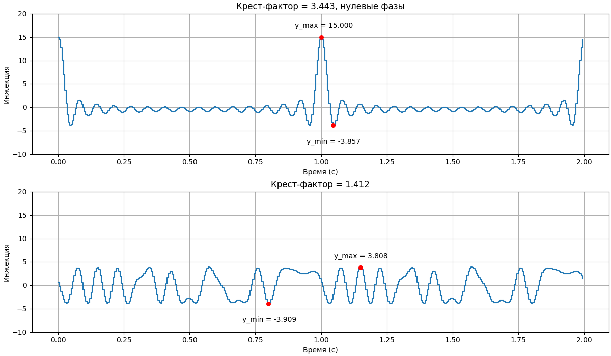

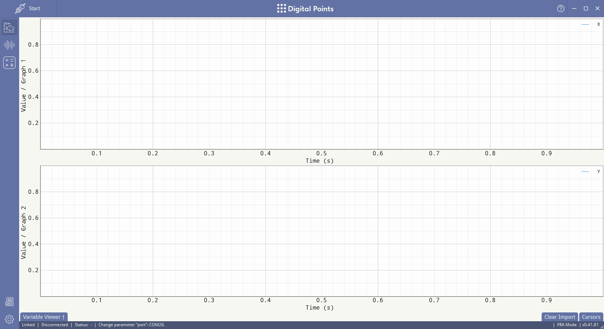

### In-Place Algorithm

During FR measurement, the server needs to keep the injection value array `s` and the response value arrays `x` and `y` in the buffer at the same time. For `n` points, that means a buffer of `3*n` entries. RAM on the target platforms is often severely limited, so DP uses an in-place algorithm for buffer handling.

At the start, the buffer's even-indexed elements are filled with the `n` injection values; the odd-indexed elements are left empty. On each sampling tick, the server pulls the next injection value from index `2*i` and hands it off to the microcontroller firmware. It then reads one value each of `x` and `y` into the elements at indices `2*i` and `2*i+1`, overwriting the injection values as it goes.

This way, the in-place algorithm shrinks the required buffer size down to `2*n`.

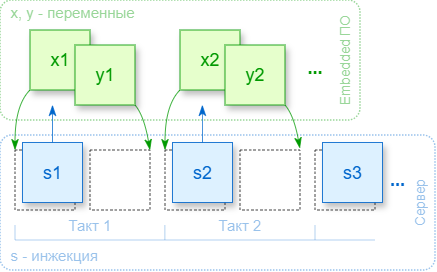

## Digital PID Controller Calculation

The digital PID controller's coefficients are calculated using a frequency-domain method based on the measured FR. The method is described in detail in [[Corradini2015](https://onlinelibrary.wiley.com/doi/book/10.1002/9781119025498)] (section "4.1 System-Level Compensator Design").

In short:
- The user loads the measured FR or imports it from a file.
- If needed, they specify correction coefficients for the FR.
- They set the desired unity-gain (crossover) frequency and phase margin.
- They click "Synthesize," and the client produces the ready-made PID controller coefficients — either as `K_p`, `K_i`, and `K_d`, or as digital-filter coefficients `a` and `b`.

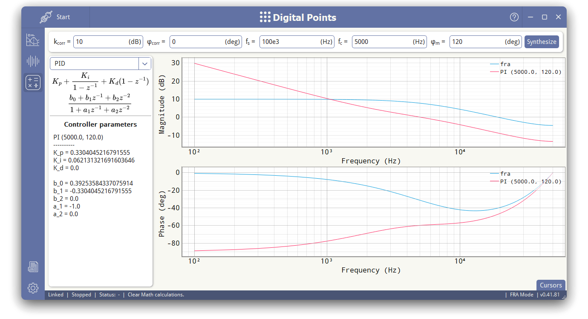

## Other Features

On top of everything else, we've added a few features that make the program easier to work with:
- Data export in CSV and PNG; import from CSV.
- Cursors with automatic calculation of the minimum, maximum, mean, and RMS values, period, frequency, and crest factor over a selected time span.
- Reading numeric variable values. Sometimes a number shown in various formats is more informative than a graph.
- Hotkeys: `Tab`/`Ctrl+Tab` to switch pages in the main window, `Ctrl+Space` to start/stop a measurement, `Esc` to close secondary windows.

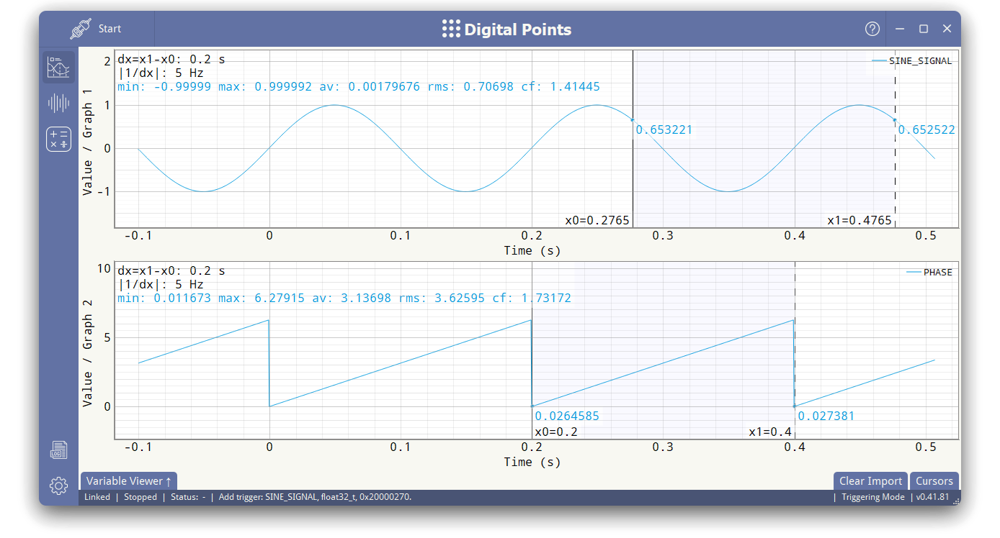

# Wrapping Up

We spent a long time deciding what license to release the source code under. On one hand, this isn't a library that other people will pull into their own projects, so a copyleft license like the GPL would have worked fine. On the other hand, if we were going to open it up, we wanted to do it in a way that's maximally useful to users and developers alike. In the end, we went with BSD-2-Clause.

Any questions or discussion — comments or DMs are welcome. Bug reports and pull requests go to the repository. The program will keep evolving regardless, since we use it ourselves. It'd be great if it turns out useful to someone else too.

Coming up next:
- Support for new architectures and communication interfaces.
- Bug fixes (can't avoid those).
- Support for working over JTAG emulators, the way [MCU Viewer](https://mcuviewer.com/) or [STM32CubeMonitor](https://www.st.com/en/development-tools/stm32cubemonitor.html) do.
- Debugging multiple devices at once.
- Adding other classical methods for digital controller design.

**Repository links**: [GitHub](https://github.com/jankinjack/digital-points) (primary), [SourceCraft](https://sourcecraft.dev/jankinjack/digital-points) (a backup, just in case)

You'll find an animation of the program running in its various modes in the README.
